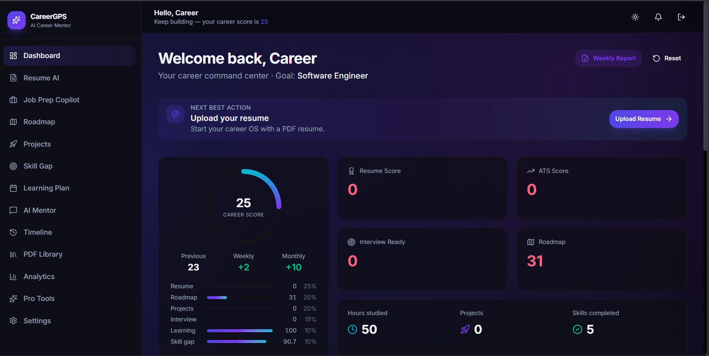
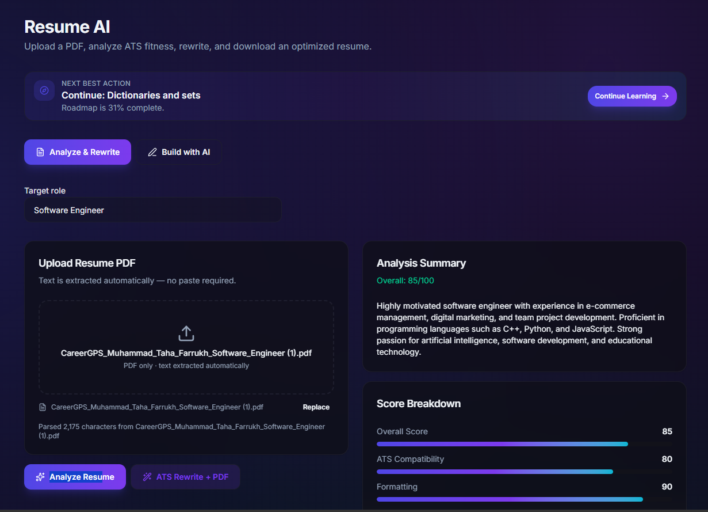
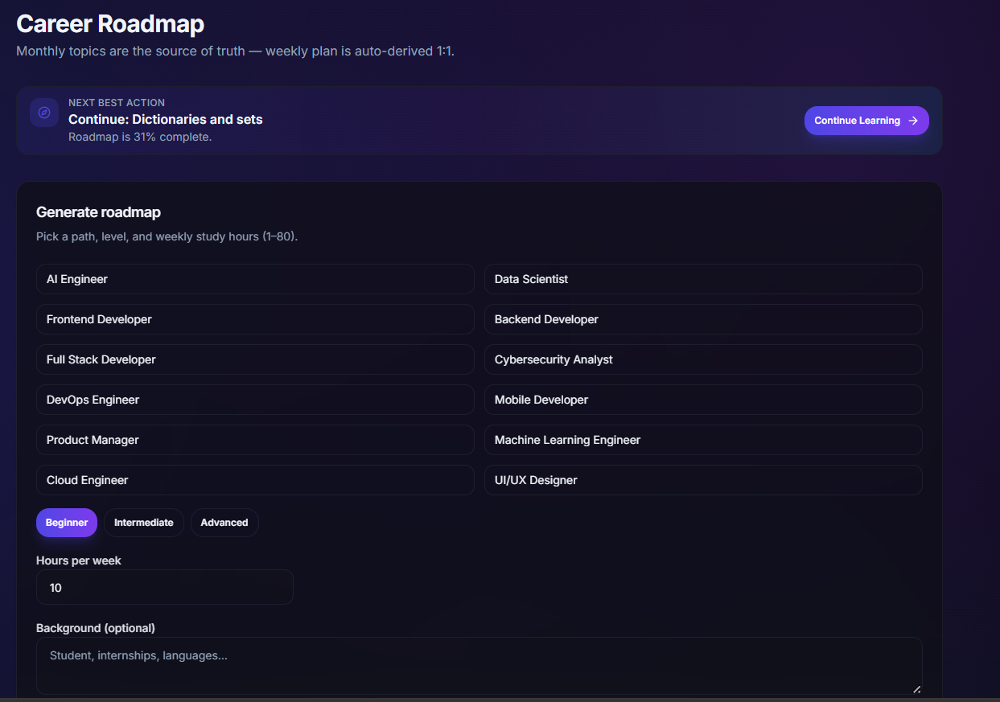
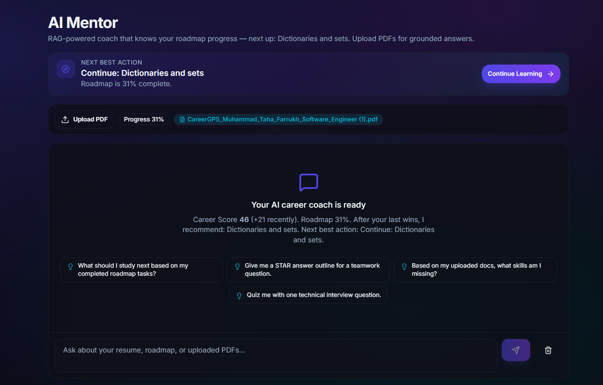
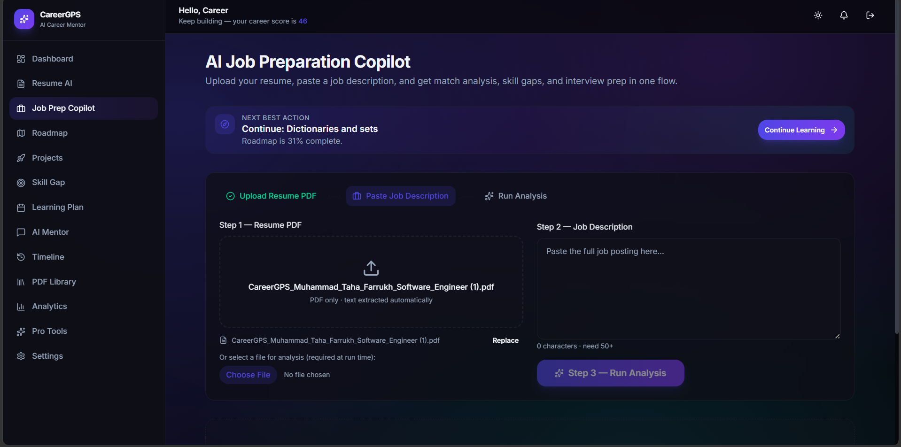
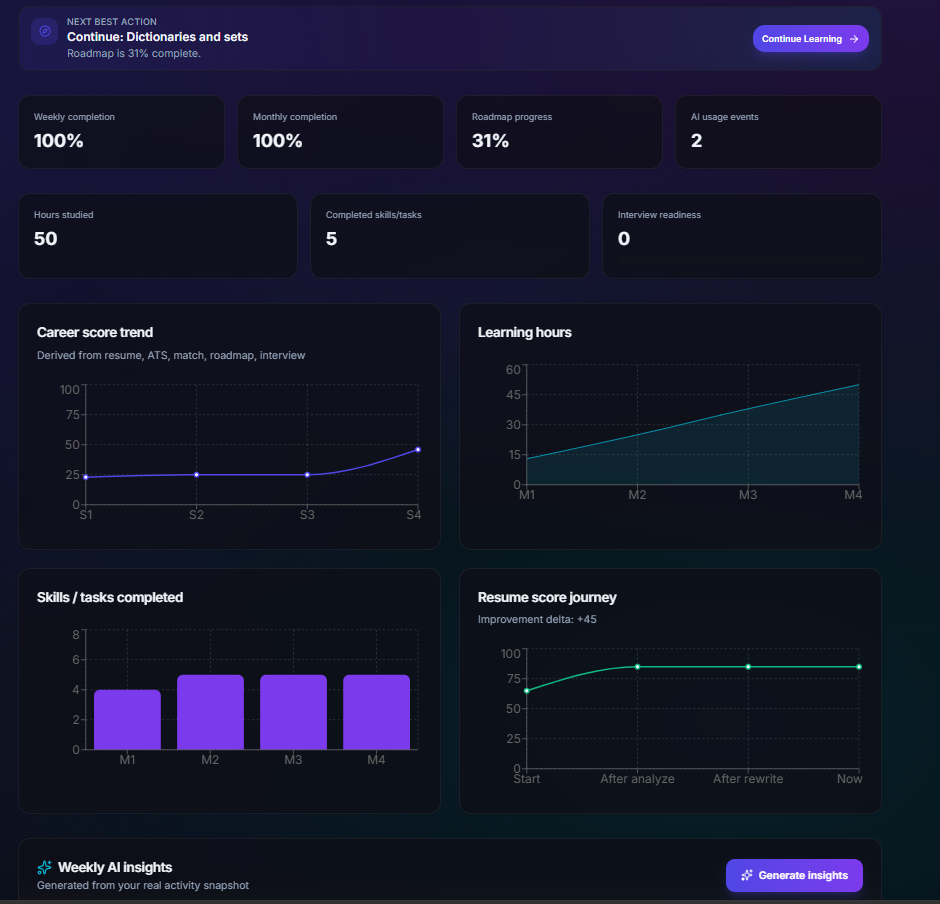

# CareerGPS AI

**Your AI-powered Career Operating System for Students & Young Professionals.**

> Built for **BuildByte** — IEEE NED Student Branch Hackathon · Team **BuildandDebug**

### Project
[](https://github.com/MTahaFarrukh/buildbyte-BuildandDebug)
[](#team)
[](#solution-overview-in-our-own-words)
[](#for-judges--evaluators)

### Repository
[](https://github.com/MTahaFarrukh/buildbyte-BuildandDebug)
[](#license)

### Stack
[](https://react.dev)
[](https://www.typescriptlang.org)
[](https://vitejs.dev)
[](https://fastapi.tiangolo.com)
[](https://groq.com)
[](https://supabase.com)
[](https://zustand-demo.pmnd.rs)
[](https://www.trychroma.com)

---

## For Judges / Evaluators

### Live deployment URL

| Resource | URL |
|----------|-----|
| **Live app (Vercel)** | https://buildbyte-buildand-debug-fjoh.vercel.app/ |
| **Repository** | https://github.com/MTahaFarrukh/buildbyte-BuildandDebug |
| **Local frontend** (after setup) | http://localhost:5173 |
| **Local API docs** (after setup) | http://localhost:8000/docs |
| **Local health check** | http://localhost:8000/health |

> **Frontend is live.** Full AI features need a deployed backend (`VITE_API_URL`) or run the API locally and point the env var at it. Judges may use their own Groq key for local evaluation. If an API is inaccessible, contact the team — we will resolve promptly.

### Fastest path to run

```bash
# 1) Backend
cd backend
python -m venv venv
# Windows: .\venv\Scripts\activate
# macOS/Linux: source venv/bin/activate
pip install -r requirements.txt
cp .env.example .env
# Edit .env → set at least GROQ_API_KEY (sample format in .env.example)
uvicorn main:app --reload --port 8000

# 2) Frontend (new terminal)
cd frontend
npm install
cp .env.example .env
# VITE_API_URL=http://localhost:8000 is already set
npm run dev
```

Open **http://localhost:5173** → Sign up with any email/password (demo mode) → follow the [Demo Script](#demo-script-judges).

---

## Team

| Field | Details |
|-------|---------|
| **Team name** | **BuildandDebug** |
| **Members** | Muhammad Taha Farrukh · Muhammad Bilal Rasheed |
| **Repository** | https://github.com/MTahaFarrukh/buildbyte-BuildandDebug |
| **Product** | CareerGPS AI |
| **Live demo** | https://buildbyte-buildand-debug-fjoh.vercel.app/ |

---

## Solution Overview (in our own words)

Students graduate every year with degrees but without a clear hiring path. They don’t know which skills companies actually want, whether their resume will pass ATS filters, what projects to build, or how to prepare for interviews. Generic chatbots give advice that disappears the moment the tab closes — no roadmap, no scores, no downloadable resume, no progress.

**CareerGPS AI** is our answer: a **Career Operating System** — not a pile of disconnected AI tools. One shared workspace powers resume analysis, job prep, roadmaps, projects, interviews, mentor chat, analytics, achievements, and a live Career Score. Changing data in one module immediately updates every other module.

We designed it like a real SaaS product (Notion AI × Duolingo × LinkedIn Learning energy): dark/light theme, glass UI, gamified roadmap progress, achievement confetti, weekly PDF reports, and a modular FastAPI backend with structured JSON prompts so every AI feature returns usable data.

---

## Why this is innovative

Most “career AI” demos stop at one chat box. CareerGPS combines **diagnose → plan → practice → package → progress** in one loop:

1. **Diagnose** — resume scores, skill gaps, JD match %
2. **Plan** — personalized roadmaps + learning planner
3. **Practice** — interview suites + RAG mentor with full career memory
4. **Package** — ATS rewrite & AI-built resumes as real PDFs
5. **Progress** — Career Score engine, achievements, timeline, weekly report PDF

The differentiator is not “we called an LLM.” It is a **unified career workspace** where scores, tasks, PDFs, and mentor memory stay connected.

---

## Features

| Feature | Description |
|---------|-------------|
| **Landing** | Premium marketing page — hero, features, testimonials, FAQ |
| **Auth** | Signup, login, forgot password, Google OAuth (Supabase) · demo auth without keys |
| **Dashboard** | Command center: Career Score breakdown, today’s tasks, achievements, weekly report export |
| **Career Score Engine** | Weighted live score (Resume 25% · Roadmap 20% · Projects 20% · Interview 15% · Learning 10% · Skill Gap 10%) |
| **Smart Recommendations** | Next-best-action banners on every major page |
| **Resume AI** | PDF upload, multi-score analysis, ATS rewrite, **downloadable PDF** |
| **Build Resume** | No resume? AI builds one from your details → **PDF export** |
| **Job Prep Copilot** | PDF + JD → match, skill gap, interview prep, RAG chat, interview history |
| **Roadmap** | Monthly topics → weekly plan + ☐ / ◐ / ☑ gamified tasks |
| **Achievements** | Badges + confetti (first resume, week one, score 80+, etc.) |
| **Projects** | AI project ideas → trackable status, GitHub link, completion → score |
| **Skill Gap** | Priority-ordered missing skills synced to workspace |
| **Learning Planner** | Daily / weekly / monthly adaptive plans |
| **AI Mentor** | Proactive coach with RAG + full Career OS memory |
| **Timeline** | Contribution-style heatmap of career journey events |
| **PDF Library** | View / rename / delete / reuse uploaded PDFs across modules |
| **Analytics** | Charts from real workspace progress |
| **Weekly Report** | AI summary + downloadable PDF |
| **Pro Tools** | LinkedIn, portfolio, and GitHub profile reviews |
| **Settings** | Theme, notifications, profile, account controls |

### Guided user flow

```
Landing → Signup → Upload Resume → Analysis → Career Score
       → Generate Roadmap → Complete Tasks → Projects
       → Mock Interview → Improve Resume → Apply for Jobs
```

---

## Screenshots

| Dashboard | Resume AI |
|-----------|-----------|
|  |  |

| Roadmap | AI Mentor |
|---------|-----------|
|  |  |

| Job Prep | Analytics |
|----------|-----------|
|  |  |

More under `docs/screenshots/` (`protools.png`, `light.png`, `hero-placeholder.png`).

---

## Tech Stack

### Frontend
React · Vite · TypeScript · Tailwind CSS v4 · Zustand (per-user persisted Career Workspace) · Framer Motion · React Router · Lucide · Axios · Recharts · Sonner · Supabase JS

### Backend
FastAPI · Uvicorn · LangChain · Groq (Llama 3.3 70B) · ChromaDB + sentence-transformers (RAG) · Pydantic · pypdf · ReportLab (resume + weekly report PDFs) · Supabase (Auth, DB, Storage)

---

## Low-Level Design (codebase map for review)

Judges reviewing architecture can start here:

```
frontend/src/
├── store/workspace.ts          # Single Career OS state (Zustand + per-user localStorage)
├── lib/careerEngine.ts         # Career Score weights + recommendations + achievements
├── lib/api.ts                  # Axios client → FastAPI /api/*
├── context/AuthContext.tsx     # Auth + bindWorkspaceToUser(userId) on login/logout
├── pages/*                     # Feature screens (Resume, Job Prep, Roadmap, Mentor, …)
└── components/                 # Shared UI, RecommendationBanner, ResumePdfUploader

backend/
├── main.py                     # FastAPI app + CORS + router mount
├── config.py                   # pydantic-settings (.env)
├── routers/                    # Thin HTTP layer (auth, resume, job, chat, …)
├── services/
│   ├── ai_service.py           # Groq / LangChain JSON generation
│   ├── rag_service.py          # Chroma embed + retrieve
│   ├── pdf_resume.py           # ReportLab resume PDF
│   ├── pdf_weekly_report.py    # Weekly progress PDF
│   └── roadmap_derive.py       # Monthly topics → weekly plan
├── prompts/templates.py        # Structured prompt contracts
├── schemas/models.py           # Request/response models
└── database/                   # Supabase client + schema.sql
```

### Request flow (example: Resume Analyze)

```
UI (ResumePage)
  → resumeApi.analyze()
  → POST /api/resume/analyze
  → routers/resume.py
  → services/ai_service.py + prompts
  → JSON scores
  → workspace.setResumeAnalysis()  # updates Career Score, Dashboard, Mentor memory
```

### Design principles
- **Routers stay thin** — validation + orchestration only
- **Services own side effects** — AI, PDF, RAG, storage
- **Prompts return structured JSON** — UI never scrapes free text
- **Demo fallbacks** — if `GROQ_API_KEY` is missing, endpoints still return usable demo payloads
- **Per-user workspace** — `bindWorkspaceToUser()` isolates local progress by account id

---

## Architecture

```
┌─────────────┐     REST/JSON      ┌──────────────┐
│  React App  │ ◄────────────────► │   FastAPI    │
│  + Zustand  │                    │   (local /   │
│ Career OS   │                    │    Render)   │
└──────┬──────┘                    └──────┬───────┘
       │ Supabase Auth (optional)         │
       ▼                       ┌──────────┼──────────┐
┌─────────────┐                ▼          ▼          ▼
│  Supabase   │          ┌─────────┐ ┌────────┐ ┌──────────┐
│ Auth/DB/S3  │          │ Groq    │ │ChromaDB│ │ReportLab │
└─────────────┘          │ Llama   │ │  RAG   │ │   PDFs   │
                         └─────────┘ └────────┘ └──────────┘
```

---

## Folder Structure

```
buildbyte-hackathon/
├── frontend/                 # React + Vite app
│   ├── src/
│   ├── .env.example          # Sample frontend env (safe to commit)
│   └── package.json
├── backend/                  # FastAPI API
│   ├── routers/ services/ schemas/ prompts/ database/
│   ├── .env.example          # Sample backend env (safe to commit)
│   ├── requirements.txt
│   └── render.yaml           # Optional Render blueprint
├── docs/screenshots/         # Product screenshots
└── README.md
```

---

## Detailed Setup Instructions

### Prerequisites

| Tool | Version | Notes |
|------|---------|-------|
| Node.js | 20+ | Frontend |
| Python | 3.11+ | Backend |
| Groq API key | Free tier OK | https://console.groq.com — **required for live AI** |
| Supabase project | Optional | Real auth/storage; **demo auth works without it** |

### 1. Clone

```bash
git clone https://github.com/MTahaFarrukh/buildbyte-BuildandDebug.git
cd buildbyte-BuildandDebug
```

### 2. Backend

```bash
cd backend
python -m venv venv

# Windows
.\venv\Scripts\activate

# macOS / Linux
source venv/bin/activate

pip install -r requirements.txt
cp .env.example .env
```

Edit `backend/.env` using the [Environment Variables](#environment-variables-with-sample-values) section.

```bash
uvicorn main:app --reload --port 8000
```

- API docs: http://localhost:8000/docs  
- Health: http://localhost:8000/health  

### 3. Frontend

```bash
cd frontend
npm install
cp .env.example .env
# Ensure VITE_API_URL=http://localhost:8000
npm run dev
```

App: http://localhost:5173

### 4. Optional Supabase (production-like auth)

1. Create a project at https://supabase.com  
2. Copy Project URL + anon key + service role key into both `.env` files  
3. Run `backend/database/schema.sql` in the SQL Editor  
4. Create Storage bucket: `resumes`  
5. Auth → Email → disable **Confirm email** for hackathon demos  
6. Optional: enable Google OAuth provider  

### Notes for evaluators
- First RAG / mentor PDF upload may download `all-MiniLM-L6-v2` once (network required).  
- Without `GROQ_API_KEY`, the API still responds with **demo JSON** so the UI remains clickable.  
- Each signed-in account keeps a **separate** Career Workspace in browser storage.

---

## Environment Variables (with sample values)

> **Never commit real secrets.** Copy from `.env.example` → `.env` and replace samples with your keys.  
> Samples below are **format examples only** — not working credentials.

### Backend — `backend/.env`

| Variable | Required | Sample value | Description |
|----------|----------|--------------|-------------|
| `GROQ_API_KEY` | **Yes** (for live AI) | `gsk_xxxxxxxxxxxxxxxxxxxxxxxxxxxxxxxxxxxxxxxx` | Groq API key → https://console.groq.com |
| `GROQ_MODEL` | No | `llama-3.3-70b-versatile` | Default chat model |
| `SUPABASE_URL` | No* | `https://abcdefghijklmnop.supabase.co` | Project URL — **no** `/rest/v1/` suffix |
| `SUPABASE_KEY` | No* | `eyJhbGciOiJIUzI1NiIsInR5cCI6IkpXVCJ9.example_anon_key` | Supabase anon / public key |
| `SUPABASE_SERVICE_KEY` | No* | `eyJhbGciOiJIUzI1NiIsInR5cCI6IkpXVCJ9.example_service_role_key` | Service role (storage/admin) |
| `FRONTEND_URL` | No | `http://localhost:5173` | CORS allowed origin |
| `ENVIRONMENT` | No | `development` | `development` \| `production` |
| `PORT` | No | `8000` | Uvicorn port |

\*Optional: leave blank to use **demo auth** (any email/password works locally).

**Example `backend/.env`:**

```env
GROQ_API_KEY=gsk_xxxxxxxxxxxxxxxxxxxxxxxxxxxxxxxxxxxxxxxx
GROQ_MODEL=llama-3.3-70b-versatile
SUPABASE_URL=https://abcdefghijklmnop.supabase.co
SUPABASE_KEY=eyJhbGciOiJIUzI1NiIsInR5cCI6IkpXVCJ9.example_anon_key
SUPABASE_SERVICE_KEY=eyJhbGciOiJIUzI1NiIsInR5cCI6IkpXVCJ9.example_service_role_key
FRONTEND_URL=http://localhost:5173
ENVIRONMENT=development
PORT=8000
```

### Frontend — `frontend/.env`

| Variable | Required | Sample value | Description |
|----------|----------|--------------|-------------|
| `VITE_API_URL` | **Yes** | `http://localhost:8000` | Backend base URL (no `/api` suffix — client adds `/api`) |
| `VITE_SUPABASE_URL` | No* | `https://abcdefghijklmnop.supabase.co` | Same as `SUPABASE_URL` |
| `VITE_SUPABASE_ANON_KEY` | No* | `eyJhbGciOiJIUzI1NiIsInR5cCI6IkpXVCJ9.example_anon_key` | Same as `SUPABASE_KEY` |

**Example `frontend/.env`:**

```env
VITE_API_URL=http://localhost:8000
VITE_SUPABASE_URL=https://abcdefghijklmnop.supabase.co
VITE_SUPABASE_ANON_KEY=eyJhbGciOiJIUzI1NiIsInR5cCI6IkpXVCJ9.example_anon_key
```

---

## API Endpoints

| Method | Path | Description |
|--------|------|-------------|
| POST | `/api/auth/signup` | Register |
| POST | `/api/auth/login` | Login |
| POST | `/api/auth/forgot-password` | Password reset |
| POST | `/api/resume/upload` | Upload PDF |
| POST | `/api/resume/analyze` | AI resume analysis |
| POST | `/api/resume/rewrite` | ATS rewrite + PDF (`pdf_base64`) |
| POST | `/api/resume/build` | Build resume from profile + PDF |
| POST | `/api/resume/pdf` | Generate PDF from structured/plain text |
| POST | `/api/job/analyze` | Resume vs JD |
| POST | `/api/job/analyze-pdf` | PDF resume + JD → match, gap, interview, RAG |
| POST | `/api/roadmap/generate` | Career roadmap (monthly → weekly derived) |
| POST | `/api/project/generate` | Project ideas |
| POST | `/api/interview/generate` | Interview prep |
| POST | `/api/skills/analyze` | Skill gap |
| POST | `/api/planner` | Learning plan |
| POST | `/api/chat` | Career mentor (RAG-aware) |
| POST | `/api/chat/upload-pdf` | Embed PDF into Chroma for mentor |
| GET | `/api/dashboard/{user_id}` | Dashboard data |
| POST | `/api/bonus/linkedin` | LinkedIn review |
| POST | `/api/bonus/portfolio` | Portfolio review |
| POST | `/api/bonus/github` | GitHub analysis |
| POST | `/api/bonus/insights` | Weekly AI insights |
| POST | `/api/bonus/weekly-report` | Weekly progress report PDF |

Interactive docs: http://localhost:8000/docs

---

## Demo Script (judges)

1. Sign up with any email/password (demo mode) → **Dashboard**
2. **Resume AI** → upload PDF → Analyze → ATS Rewrite + download PDF
3. Watch **Career Score** update in the top bar
4. **Job Prep Copilot** → resume + paste a JD → match % + interview history
5. **Roadmap** → generate → cycle tasks ☐ → ◐ → ☑
6. **Projects** → generate → set status / GitHub link
7. **AI Mentor** → ask “What should I study next?”
8. **Timeline** + **PDF Library**
9. Dashboard → **Weekly Report** PDF download

---

## Deployment (optional — for production later)

### Frontend → Vercel (Vite — not Create React App)

This repo is a **Vite** app in `frontend/`. Do **not** use `react-scripts build`.

**Required Vercel project settings**
1. **Root Directory** → `frontend` (Save)
2. **Framework Preset** → Vite  
3. **Build Command** → `npm run build` (clear any override)  
4. **Output Directory** → `dist`  
5. **Install Command** → `npm install`  
   - Do **not** use `npm install --prefix frontend` (that creates `frontend/frontend` and fails)

**Environment variables**

| Name | Example |
|------|---------|
| `VITE_API_URL` | `https://your-api.onrender.com` |
| `VITE_SUPABASE_URL` | `https://xxxx.supabase.co` (optional) |
| `VITE_SUPABASE_ANON_KEY` | `eyJ...` (optional) |

Then click **Redeploy**. Live URL: https://buildbyte-buildand-debug-fjoh.vercel.app/

---

## Submission Checklist

- [x] Team name & members documented  
- [x] Public GitHub repository  
- [x] Clear problem → solution narrative  
- [x] Detailed install & run instructions  
- [x] All environment variables listed **with sample values**  
- [x] Low-level design / codebase map for review  
- [x] Screenshots in `docs/screenshots/`  
- [x] Demo script for judges  
- [x] No real secrets committed (`.env` gitignored)  
- [x] Public live URL (frontend): https://buildbyte-buildand-debug-fjoh.vercel.app/

---

## Color Palette

| Token | Hex |
|-------|-----|
| Primary | `#4F46E5` |
| Secondary | `#7C3AED` |
| Accent | `#06B6D4` |
| Light BG | `#F8FAFC` |
| Dark BG | `#07070C` |

Typography: **Inter**

---

## License

Built for BuildByte (IEEE NED Student Branch) by **BuildandDebug**.  
For hackathon evaluation and learning use.
