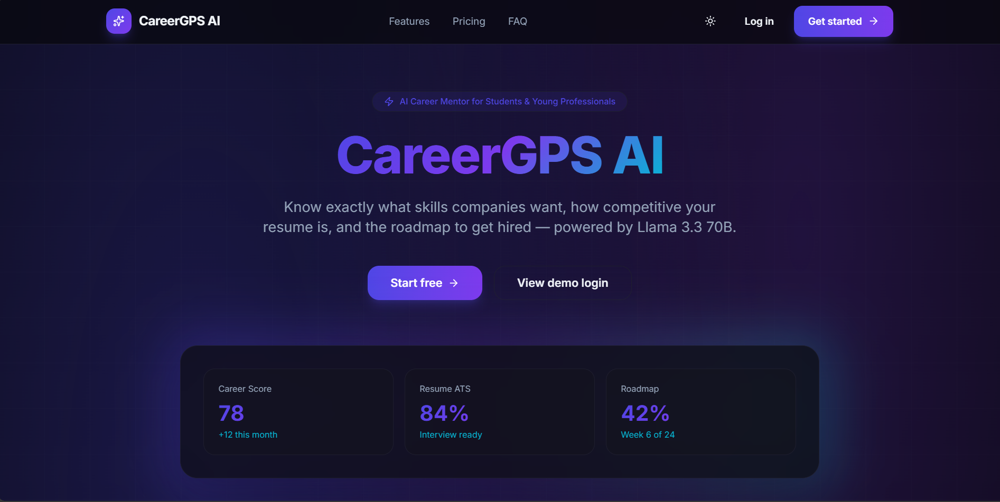

# CareerGPS AI

**Your AI Career Mentor for Students & Young Professionals.**

CareerGPS AI is a premium SaaS-style web application that helps students and early-career professionals become job-ready with personalized AI guidance — resume analysis, job matching, roadmaps, interview prep, skill gaps, learning plans, and a career mentor chat.



---

## Features

| Feature | Description |
|---------|-------------|
| **Landing** | Linear/Vercel-inspired marketing page with hero, features, testimonials, pricing, FAQ |
| **Auth** | Signup, login, forgot password, Google OAuth (via Supabase) |
| **Dashboard** | Career score, tasks, recommended skills, weekly goal, roadmap progress, badges |
| **Resume AI** | PDF upload, text extraction, multi-score analysis, ATS rewrite |
| **Job Match** | Resume vs JD comparison with match %, missing skills & keywords |
| **Roadmap** | Personalized weekly/monthly timelines, courses, books, certs, projects |
| **Projects** | Beginner → Advanced portfolio project generator |
| **Interview Prep** | Technical, behavioral, HR, coding, system design + mock interview |
| **Skill Gap** | Current vs missing skills with priority, difficulty, time estimates |
| **Learning Planner** | Daily / weekly / monthly adaptive plans |
| **AI Mentor Chat** | Context-aware career coach (not generic ChatGPT) |
| **Analytics** | Charts for progress, hours, projects, resume scores + weekly insights |
| **Pro Tools** | LinkedIn review, portfolio review, GitHub analysis |
| **Settings** | Theme, notifications, profile, delete account |
| **Bonus** | Career confidence score, gamification badges, ATS one-click rewrite |

---

## Tech Stack

### Frontend
- React + Vite + TypeScript
- Tailwind CSS v4
- Framer Motion
- React Router
- React Hook Form
- Lucide Icons
- Axios
- Recharts
- Sonner
- Supabase JS (Auth)

### Backend
- FastAPI + Uvicorn
- LangChain + Groq (Llama 3.3 70B)
- Pydantic
- python-dotenv
- pypdf
- Supabase (Auth, DB, Storage)

---

## Folder Structure

```
buildbyte-hackathon/
├── frontend/                 # React Vite app
│   ├── src/
│   │   ├── components/       # UI + layout
│   │   ├── context/          # Auth + Theme
│   │   ├── lib/              # API, Supabase, utils
│   │   ├── pages/            # All screens
│   │   ├── App.tsx
│   │   └── main.tsx
│   ├── public/
│   ├── .env.example
│   └── package.json
├── backend/                  # FastAPI API
│   ├── routers/              # API endpoints
│   ├── services/             # AI + demo fallbacks
│   ├── schemas/              # Pydantic models
│   ├── prompts/              # Prompt templates
│   ├── database/             # Supabase client + SQL schema
│   ├── utils/
│   ├── main.py
│   ├── config.py
│   ├── requirements.txt
│   └── .env.example
├── docs/screenshots/         # Screenshot placeholders
└── README.md
```

---

## Quick Start

### Prerequisites
- Node.js 20+
- Python 3.11+
- (Optional) Groq API key
- (Optional) Supabase project

### 1. Backend

```bash
cd backend
python -m venv venv

# Windows
.\venv\Scripts\activate

# macOS / Linux
source venv/bin/activate

pip install -r requirements.txt
copy .env.example .env   # or: cp .env.example .env
# Edit .env and add GROQ_API_KEY (optional — demo mode works without it)

uvicorn main:app --reload --port 8000
```

API docs: http://localhost:8000/docs  
Health: http://localhost:8000/health

### 2. Frontend

```bash
cd frontend
npm install
copy .env.example .env   # or: cp .env.example .env
npm run dev
```

App: http://localhost:5173

### Demo login
Without Supabase, **any email/password** works in demo mode. Full AI responses require a Groq API key.

---

## Environment Variables

### Backend (`backend/.env`)

| Variable | Description |
|----------|-------------|
| `GROQ_API_KEY` | Groq API key for Llama 3.3 70B |
| `GROQ_MODEL` | Default: `llama-3.3-70b-versatile` |
| `SUPABASE_URL` | Supabase project URL |
| `SUPABASE_KEY` | Supabase anon key |
| `SUPABASE_SERVICE_KEY` | Service role key (storage/admin) |
| `FRONTEND_URL` | CORS origin (default `http://localhost:5173`) |
| `PORT` | API port (default `8000`) |

### Frontend (`frontend/.env`)

| Variable | Description |
|----------|-------------|
| `VITE_API_URL` | Backend URL (`http://localhost:8000`) |
| `VITE_SUPABASE_URL` | Supabase URL (optional) |
| `VITE_SUPABASE_ANON_KEY` | Supabase anon key (optional) |

### API Keys
1. **Groq** — https://console.groq.com → create API key  
2. **Supabase** — https://supabase.com → create project → Settings → API  
3. Run `backend/database/schema.sql` in the Supabase SQL editor  
4. Create a Storage bucket named `resumes`  
5. Enable Google provider under Authentication → Providers  

---

## API Endpoints

| Method | Path | Description |
|--------|------|-------------|
| POST | `/api/auth/signup` | Register |
| POST | `/api/auth/login` | Login |
| POST | `/api/auth/forgot-password` | Password reset |
| POST | `/api/resume/upload` | Upload PDF |
| POST | `/api/resume/analyze` | AI resume analysis |
| POST | `/api/resume/rewrite` | ATS rewrite |
| POST | `/api/job/analyze` | Resume vs JD |
| POST | `/api/roadmap/generate` | Career roadmap |
| POST | `/api/project/generate` | Project ideas |
| POST | `/api/interview/generate` | Interview prep |
| POST | `/api/skills/analyze` | Skill gap |
| POST | `/api/planner` | Learning plan |
| POST | `/api/chat` | Career mentor |
| GET | `/api/dashboard/{user_id}` | Dashboard data |
| POST | `/api/bonus/linkedin` | LinkedIn review |
| POST | `/api/bonus/portfolio` | Portfolio review |
| POST | `/api/bonus/github` | GitHub analysis |
| POST | `/api/bonus/insights` | Weekly AI insights |

---

## Architecture

```
┌─────────────┐     REST/JSON      ┌──────────────┐
│  React App  │ ◄────────────────► │   FastAPI    │
│  (Vercel)   │                    │   (Render)   │
└──────┬──────┘                    └──────┬───────┘
       │                                  │
       │ Supabase Auth                    │ LangChain
       ▼                                  ▼
┌─────────────┐                    ┌──────────────┐
│  Supabase   │                    │  Groq API    │
│ Auth/DB/S3  │                    │ Llama 3.3 70B│
└─────────────┘                    └──────────────┘
```

- Modular backend: `routers` → `services` → `prompts` / `database`
- Structured JSON prompts for every AI feature
- Demo fallbacks when `GROQ_API_KEY` is missing (hackathon-ready)

---

## Deployment

### Frontend → Vercel
1. Import the `frontend` folder as a Vercel project  
2. Set env: `VITE_API_URL`, `VITE_SUPABASE_URL`, `VITE_SUPABASE_ANON_KEY`  
3. Build command: `npm run build`  
4. Output: `dist`

### Backend → Render
1. New Web Service from `backend`  
2. Build: `pip install -r requirements.txt`  
3. Start: `uvicorn main:app --host 0.0.0.0 --port $PORT`  
4. Set env vars from `.env.example`  
5. Update `FRONTEND_URL` and frontend `VITE_API_URL` to production URLs  

---

## Screenshots

Place PNGs in `docs/screenshots/`:

- `hero-placeholder.png` — Landing hero  
- `dashboard.png` — Dashboard  
- `resume.png` — Resume analysis  
- `roadmap.png` — Career roadmap  
- `chat.png` — AI mentor  

---

## Color Palette

| Token | Hex |
|-------|-----|
| Primary | `#4F46E5` |
| Secondary | `#7C3AED` |
| Accent | `#06B6D4` |
| Light BG | `#F8FAFC` |
| Dark BG | `#07070C` |

Typography: **Inter**

---

## License

Built for the BuildByte Hackathon. Use freely for demos and learning.
